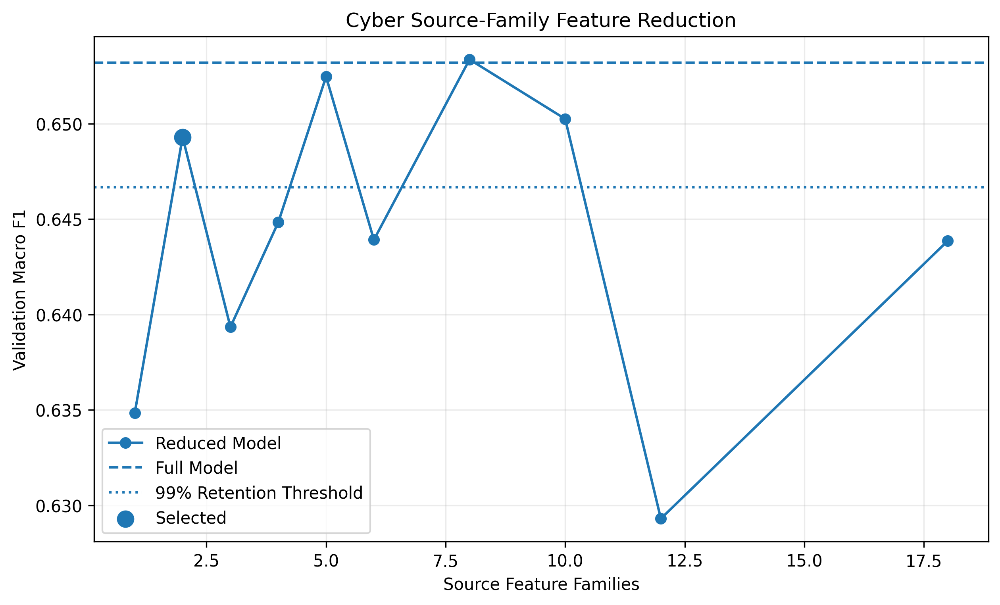
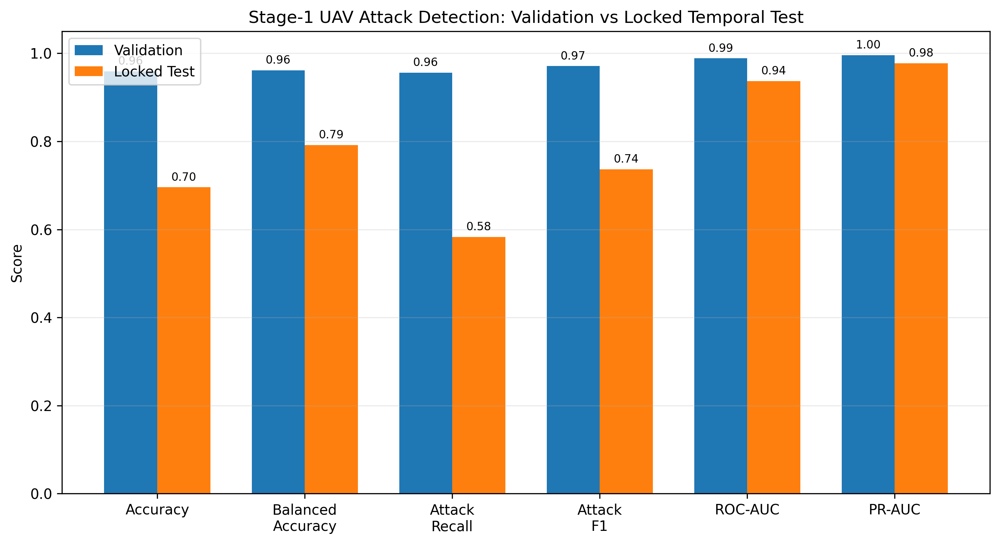
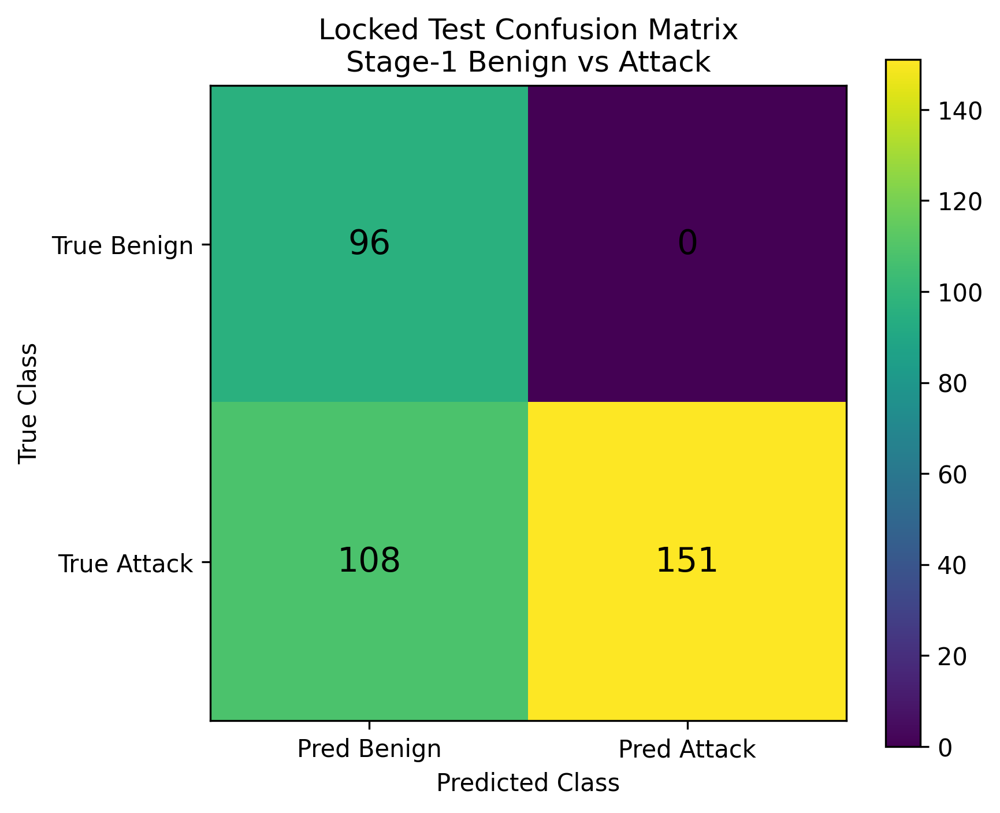
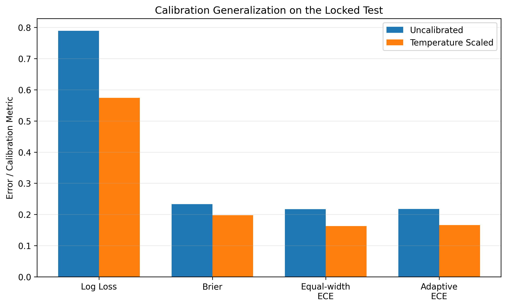
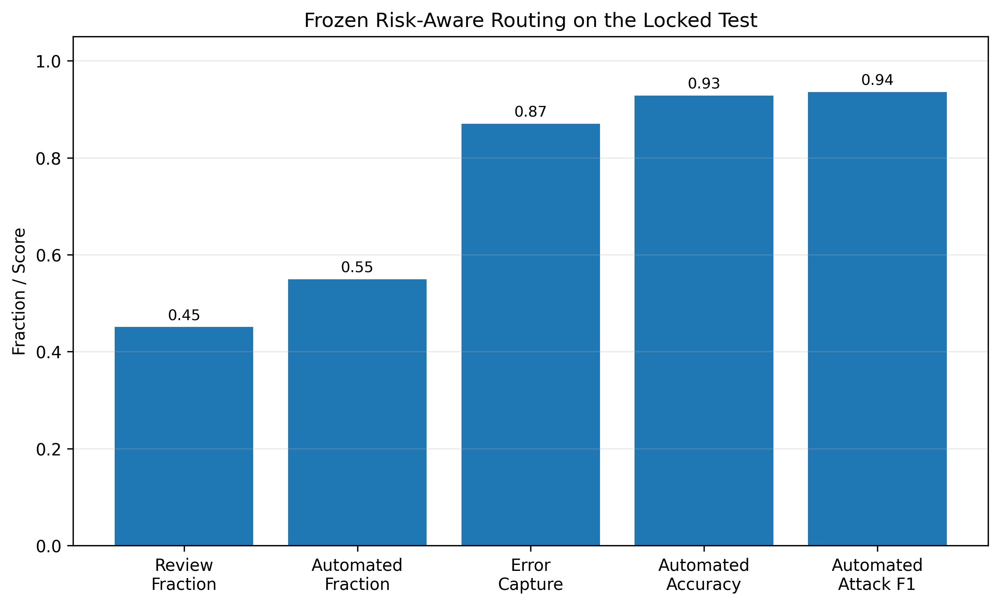
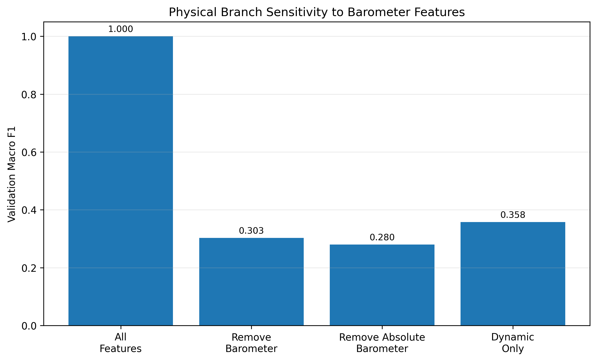

# Reliable UAV Cyber-Physical Security

Leakage-aware UAV attack detection, probability calibration,
and risk-aware routing under temporal distribution shift.

## Overview

This project studies UAV cybersecurity with emphasis on
reliability rather than headline classification accuracy.

The workflow includes:

- multi-schema dataset auditing,
- leakage-aware parsing,
- temporal window construction,
- chronological group-held-out evaluation,
- feature reduction,
- probability calibration,
- uncertainty-aware routing,
- and explicit confounding analysis.

## Dataset structure

The original CSV is not one homogeneous machine-learning table.

It contains ten cyber and physical sections with different schemas.

| Section            | Class     | Modality   | Schema            |   Rows |   Predictors |
|:-------------------|:----------|:-----------|:------------------|-------:|-------------:|
| cyber_benign       | Benign    | cyber      | cyber_schema_A    |   9425 |           37 |
| physical_benign    | Benign    | physical   | physical_schema_A |   4290 |           16 |
| cyber_dos          | DoS       | cyber      | cyber_schema_A    |  11671 |           37 |
| physical_dos       | DoS       | physical   | physical_schema_A |    973 |           16 |
| cyber_replay       | Replay    | cyber      | cyber_schema_A    |  12006 |           37 |
| physical_replay    | Replay    | physical   | physical_schema_A |    973 |           16 |
| cyber_evil_twin    | Evil Twin | cyber      | cyber_schema_B    |   5683 |           34 |
| physical_evil_twin | Evil Twin | physical   | physical_schema_B |   5473 |           21 |
| cyber_fdi          | FDI       | cyber      | cyber_schema_B    |   3473 |           34 |
| physical_fdi       | FDI       | physical   | physical_schema_C |    807 |           31 |

A naïve global classifier could learn schema identity instead of
attack behavior.

Therefore, the primary comparable experiment uses Schema A:

- Benign
- DoS
- Replay

## Primary cyber task

The final Stage-1 task is:

**Benign vs Attack**

where:

`Attack = DoS OR Replay`

The model uses windows of 20 cyber observations.

Temporal segments are separated when timestamps reset or when
a sufficiently large temporal gap occurs.

## Frozen split

The experiment uses a chronological segment-grouped split.

| Partition   |   Windows |
|:------------|----------:|
| train       |       960 |
| validation  |       317 |
| test        |       355 |

No temporal segment appears in more than one partition.

The Locked Test was evaluated only after the model, features,
calibration, and routing policy were frozen.

## Final feature set

The full temporal representation contained:

**161 aggregated features**

The final lightweight detector uses only:

- `time_since_last_packet`
- `wlan.fc.type`

Final aggregated feature count:

**14**

Validation Macro-F1 retention relative to the full model:

**99.40%**



## Stage-1 results

| Metric | Validation | Locked Test |
|---|---:|---:|
| Accuracy | 0.9590 | 0.6958 |
| Balanced Accuracy | 0.9612 | 0.7915 |
| Attack Precision | 0.9864 | 1.0000 |
| Attack Recall | 0.9561 | 0.5830 |
| Attack F1 | 0.9710 | 0.7366 |
| ROC-AUC | 0.9886 | 0.9369 |
| PR-AUC | 0.9961 | 0.9777 |



The locked temporal test exposed a substantial operating-point
generalization gap.

At the frozen 0.5 threshold:

- all 96 benign windows were classified correctly,
- 151 attack windows were detected,
- 108 attack windows were missed.



Despite the recall degradation, ranking remained strong:

- ROC-AUC = **0.9369**
- PR-AUC = **0.9777**

## Attack attribution

The secondary DoS-vs-Replay model was intentionally evaluated
separately.

Validation:

- Accuracy = **0.5263**
- Balanced Accuracy = **0.5369**
- Macro F1 = **0.5262**
- ROC-AUC = **0.5537**

This is not strong enough for autonomous attack-specific response.

## Probability calibration

Temperature scaling was fitted using grouped out-of-fold predictions
from the frozen training partition only.

Frozen temperature:

**T = 1.71111364**

Locked Test:

| Metric | Raw | Temperature Scaled |
|---|---:|---:|
| Log Loss | 0.7889 | 0.5741 |
| Brier | 0.2334 | 0.1978 |
| Equal-width ECE | 0.2173 | 0.1628 |
| Adaptive ECE | 0.2175 | 0.1662 |

Temperature scaling changed no labels but improved all reported
probability-quality metrics on the Locked Test.



## Risk-aware routing

Uncertainty is defined as:

`1 - max(P(Benign), P(Attack))`

Frozen uncertainty threshold:

**0.114250**

Equivalent confidence threshold:

**0.885750**

Locked Test:

- Verification fraction = **45.07%**
- Error capture = **87.04%**
- Automated fraction = **54.93%**
- Automated accuracy = **92.82%**
- Automated Attack F1 = **0.9352**



Routing actions:

- high-confidence Benign → continue monitoring
- high-confidence Attack → generic protective response
- low-confidence prediction → verification required

## Physical-domain finding

The physical Schema-A XGBoost initially achieved perfect validation
classification.

However, barometer level dominated the result.

Removing the barometer reduced Macro F1 to:

**0.3032**

Removing absolute barometer-level statistics reduced Macro F1 to:

**0.2803**



The physical branch is therefore reported as a confounding case study,
not as evidence of perfect general UAV attack detection.

## Main methodological contributions

1. Reconstruction of a heterogeneous multi-schema UAV dataset.
2. Schema-aware experimental design.
3. Leakage-resistant temporal segmentation and splitting.
4. Reduction from 161 to 14
   aggregated cyber features.
5. Separation of attack detection from weak attack attribution.
6. Grouped OOF temperature calibration.
7. Frozen uncertainty-based routing.
8. Explicit reporting of temporal generalization failure and
   physical sensor confounding.

## Repository structure

```text
reliable-uav-cyber-physical-security/
├── data/
│   ├── README.md
│   ├── raw/
│   └── processed/
├── models/
├── notebooks/
├── results/
│   ├── figures/
│   └── tables/
├── README.md
├── METHODOLOGY.md
├── RESULTS.md
├── LIMITATIONS.md
├── MODEL_CARD.md
├── requirements.txt
└── .gitignore
```

## Intended use

Cybersecurity research and methodological demonstration.

This repository is not a certified UAV safety system or
production autonomous response controller.

## Author

**Maram M. Momani**

Cybersecurity Researcher  
Machine Learning for Cybersecurity | Network & IoT Security | Cyber-Physical Systems Security
